# Final-Web-Dev-Project
# Quickserve

Quickserve is a web application that provides a platform for users to request and book instant, affordable services. The application allows users to sign up, log in, and access various services such as barber, snow removal, plumbing, mechanic, and carpentry.

Quickserve is the idea of creating a software which provides a platform to local people , or people who are good at some of there skills but lack the customer outreach to provide them the platform for offering there skills , also we are planning to have customers pay less and pay directly to the workers and not pay more bucks to the organizations who are sending the service workers.
It helps the locals skilled workers get hands on there skills and earn from a trusted customer , we also want to include the authentication feature (in future) for the workers as well as customers so that people can trust our platform. 
For example, if somebody wants to work as a gardener and I as a customer is looking for a gardener for my garden , then I will contact the institutes and they will quote me like 500 $ for the service , but through our software I will go and signup and find the guy who wants to offer the service at a low cost and also without any third party involvement, I will go and select date and time and enter my house details and then I am good to go, as the worker .
As this is the first phase of discussion, we are offering services like child care, barber, shovel for winters , gardener , plumber , carpenter and many services in the development for our software.

## Features

- User Registration and Login
- Google OAuth Integration
- Dynamic Forms and Modern Design
- Service Booking
- Display of Available Services
- City-based Service Availability

## Tech Stack

### Frontend

- React
- React Router
- @react-oauth/google
- CSS

### Backend

- Node.js
- Express
- MongoDB
- Mongoose
- Cors
- Dotenv

## Getting Started

### Prerequisites

- Node.js
- MongoDB

## Iteration 1

### Screenshots 
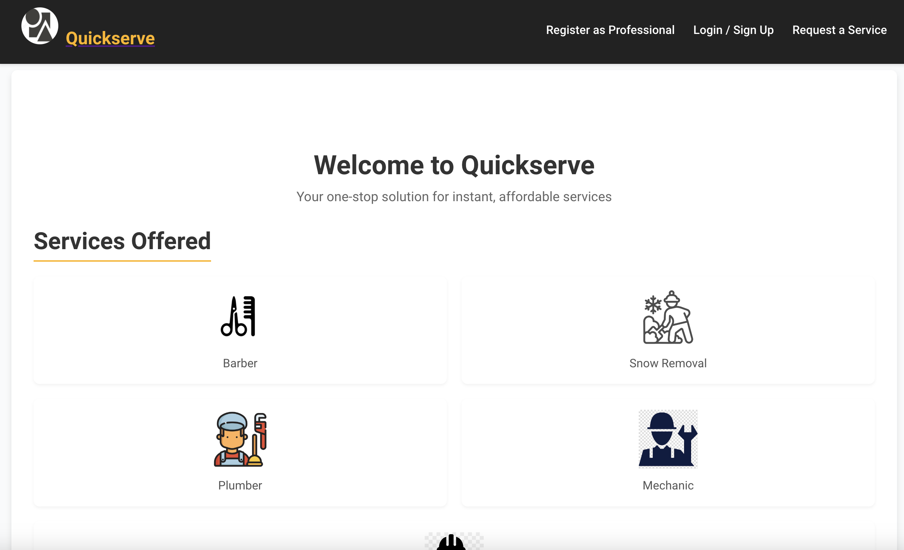
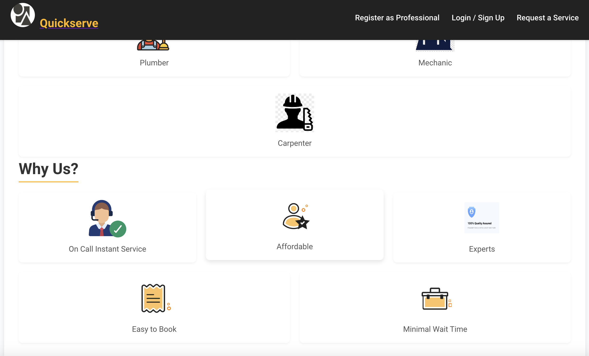
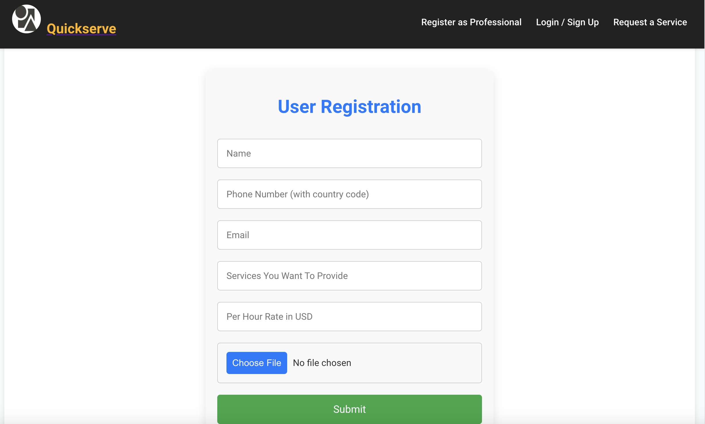
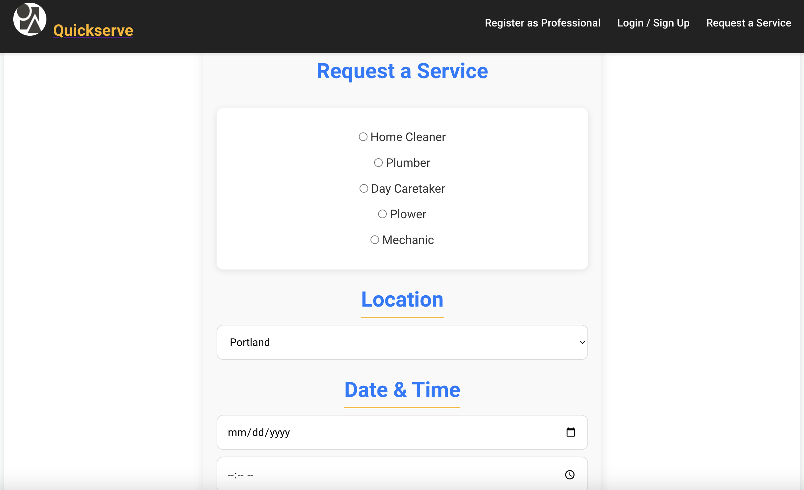

### Contributions
### Team Members

- Adit Shah : 
-             1.Frontend Codebase
-             2. Frontend Styling 
-             3. Frontend Layout and ideation 
-             4. React map component added in the background with markation of maximum sale in the cities

- Shivam Thakker :
-                  1. Backend Database 
-                  2. Backend codebase 
-                  3. Api integration 

### Challenges

- Deployment issues with google cloud in frontend , images are not visible 
- Backend deployment 

### Future Work 

- Adding functionalities for react components 
- Adding details view at the end of checkout.

## Iteration 2

In Iteration 2, we focused on improving the user experience by adding new features and enhancing existing ones. This iteration includes:

- **ContentView Page**: A new page where users can browse and select the services they want to book. After selecting a service, users are redirected to the DetailsView page.
- **DetailsView Page**: Here, users can input their address and the expected amount they wish to pay for the service. Once entered, users are redirected to the summary and checkout page.
- **Summary/Checkout Page**: This page provides a summary of the selected services, allowing users to review their choices and proceed with payment.
- Improved navigation and routing to enhance the flow between different pages.

### Screenshots

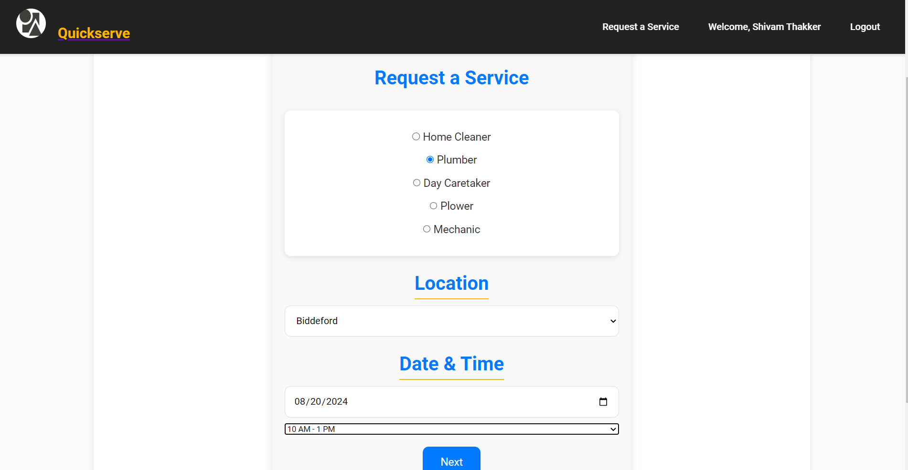
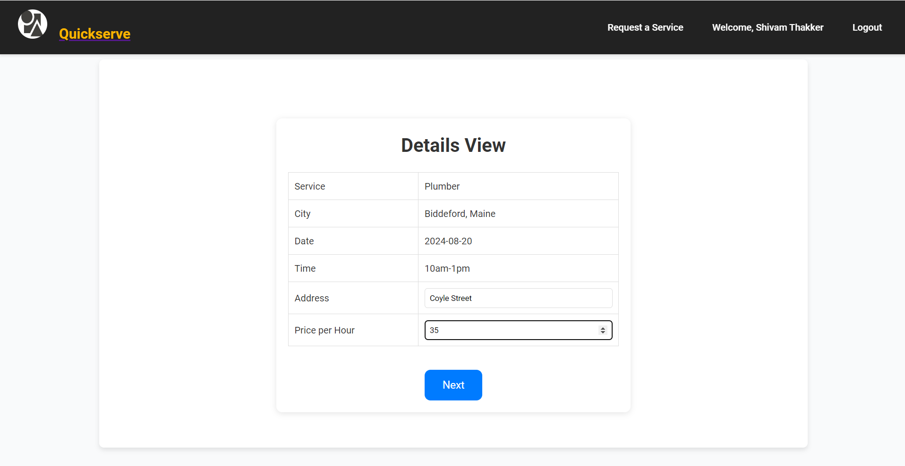
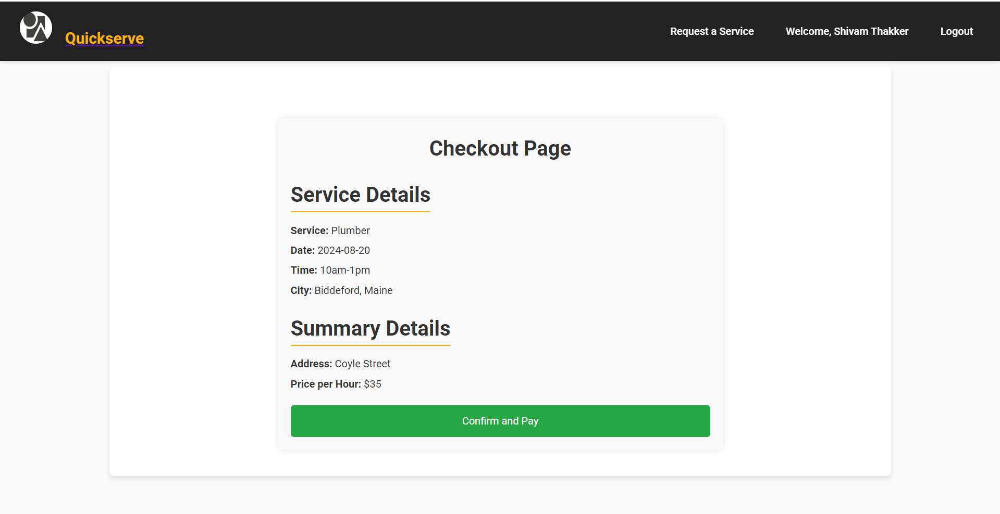

### Backend MongoDB Scrrenshots

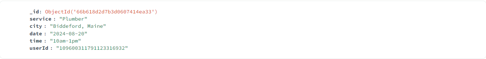

### Contributions
### Team Members

- Adit Shah : 
-                  1. Frontend Codebase
-                  2. Frontend Styling 
-                  3. Frontend Layout and ideation 
-                  4. React map component added in the background with markation of maximum sale in the cities

- Shivam Thakker :
-                  1. Backend Database 
-                  2. Backend codebase 
-                  3. Api integration
-                  4. Connection with Frontend 
-                  5. Frontend & Backend Deployment to Google Cloud

### Challenges

- Deployment issues with google cloud in Backend, Not found error 
- Few errors in frontend deployment

### Future Work 

- Update the CSS
- Complete the preliminary testing
- Fix few minor error such as few fields are not marked as required and so it allows to go to the next page even if the form is incomplete

## Iteration 3 / Final Phase Launch
In Iteration 3 we fcused on using the react leaflet library or functionality for displaying the locations and reviews for the places where we provide services along with updation in the following:

### Checkout page
Added the functionality of confirm and pay and a dialog box appearance for the confirmation.

### Improved the overall CSS for the whole website and few bug fixes 

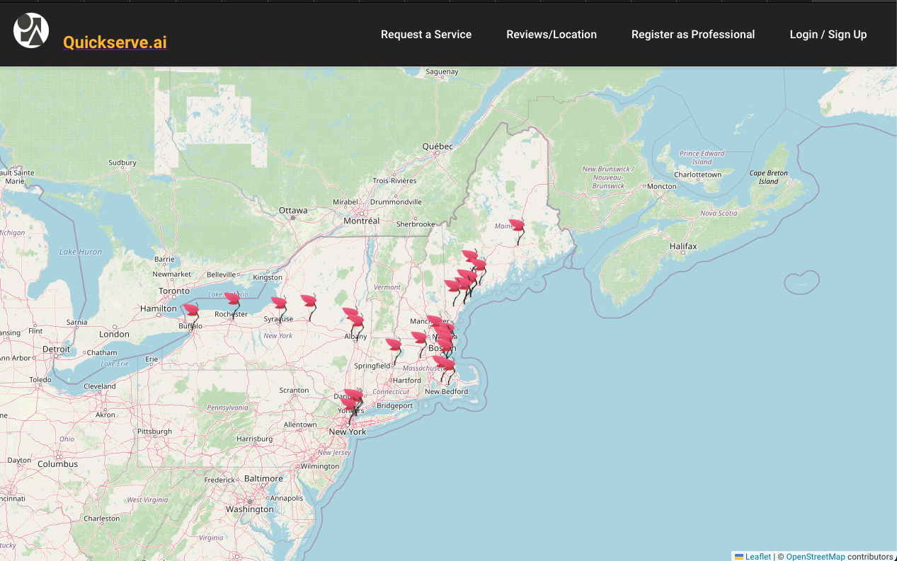
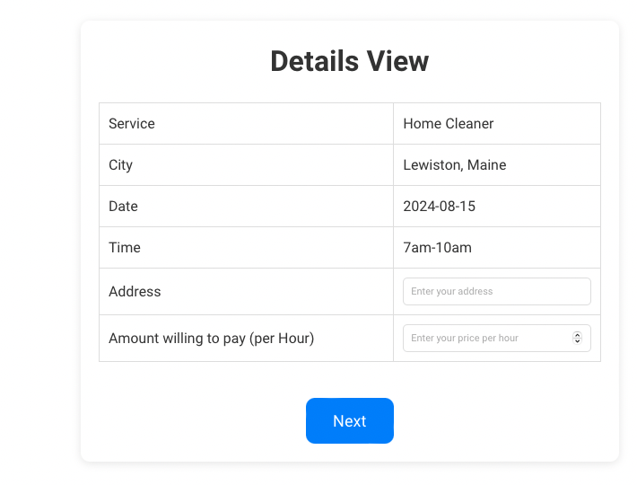
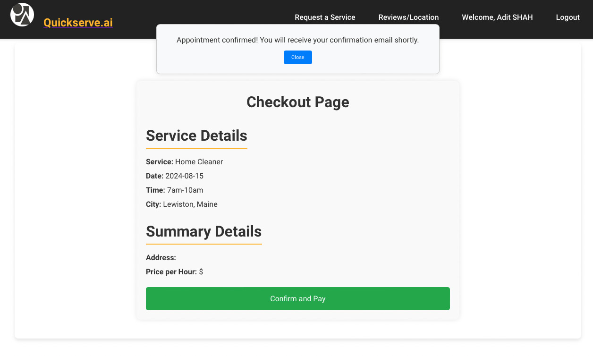

### Contributions
### Team Members

- Adit Shah : 
-                  1. Frontend Codebase
-                  2. Frontend Styling 
-                  3. Frontend Layout and ideation 
-                  4. React map component added in the background with markation of location at cities we provide services for.
-                  5. Styling change and addition of more functionalities to checkout page for confirmation.           
- Shivam Thakker :
-                  1. Backend Database 
-                  2. Backend codebase 
-                  3. Api integration
-                  4. Connection with Frontend 
-                  5. Frontend & Backend Deployment to Google Cloud

### Challenges 

We faced challenges for mapping the cities along with their langitude and longitude coordinates but it was fixed 

### Future Work

Implementation of the payment system and more upgrades for the user registering to provide the services.
